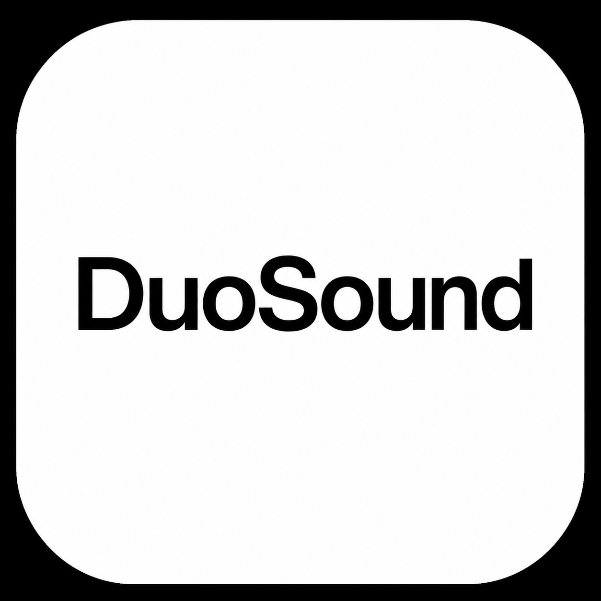

<p align="center">
  
</p>

# DuoSound

A native macOS menu bar app that lets you play audio on two or more output devices simultaneously — with one click.

No drivers. No SoundFlower. No BlackHole. Pure CoreAudio.


[](LICENSE)
[](https://ko-fi.com/tejastelkar)

---

## Install

### Homebrew (recommended)
```bash
brew tap tejastelkar/tap
brew install --cask duosound
```

### Manual
Download the latest **DuoSound.dmg** from [Releases](https://github.com/tejastelkar/duosound/releases), open it and drag DuoSound to Applications.

---

## What it does

- **Lists all connected audio output devices** — Built-in, Bluetooth, USB, AirPlay
- **Select 2 or more devices** via checkboxes
- **Play on Both** — creates a CoreAudio Multi-Output Device and sets it as system default
- **Per-device volume sliders** — control each device's volume independently in the mix
- **Reset** — restores your original default output and destroys the aggregate
- **⌥⌘D global hotkey** — toggle multi-output without opening the app
- **Disconnect notifications** — native macOS banner when a device drops mid-session
- **Persists selections** between launches

---

## How it works

Uses `AudioHardwareCreateAggregateDevice` with `kAudioAggregateDeviceIsStackedKey = 1` — the same CoreAudio HAL API that macOS's built-in Audio MIDI Setup uses to create Multi-Output Devices. No third-party audio drivers required.

---

## Building from source

Requires macOS 13+ and Swift 5.9+ (Xcode CLI tools or full Xcode).

```bash
git clone https://github.com/tejastelkar/duosound.git
cd duosound
bash build.sh
```

The built app is at `dist/DuoSound.app` and the DMG at `dist/DuoSound-1.0.dmg`.

---

## Project structure

```
DuoSound/
├── DuoSoundApp.swift          # NSStatusItem + NSPanel, hotkey, app lifecycle
├── GlobalHotKey.swift         # Carbon RegisterEventHotKey wrapper (⌥⌘D)
├── ContentView.swift          # Main popover SwiftUI view
├── Models/
│   └── AudioDevice.swift      # Device value type (id, uid, name, transport)
├── Services/
│   └── AudioDeviceManager.swift  # CoreAudio HAL wrapper
├── State/
│   └── AppState.swift         # ObservableObject — devices, selection, aggregate
└── Views/
    ├── DeviceRowView.swift     # Device row with checkbox + volume slider
    ├── AggregateCardView.swift # Active multi-output card with audio meter
    ├── ActionBarView.swift     # Play on Both / Reset buttons
    ├── BannerView.swift        # Info/warn/error banners
    └── VisualEffectView.swift  # NSVisualEffectView bridge
```

---

## Support

If DuoSound saves you time, consider supporting on Ko-fi ☕

[](https://ko-fi.com/tejastelkar)

---

## License

MIT © [Tejas Telkar](https://github.com/tejastelkar)
